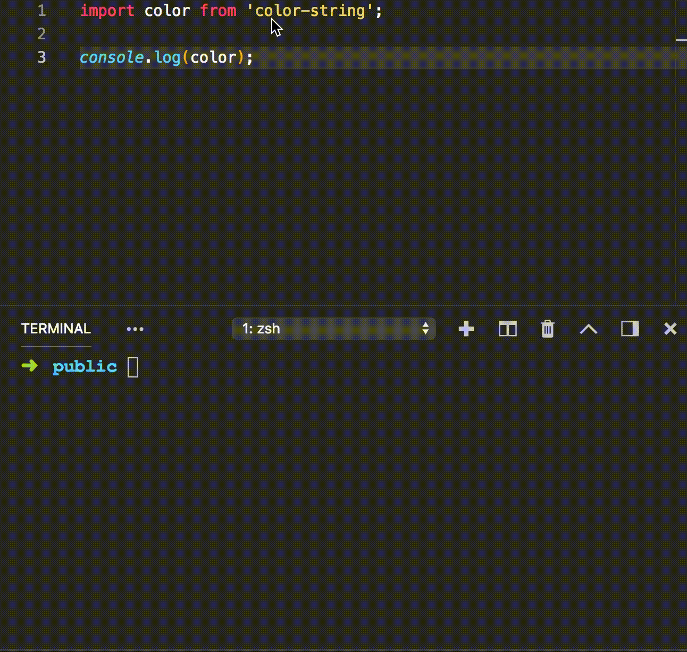

An extension to quick `npm install` directly from the editor. Usually used for pasted code which include `import` statment for an uninstalled package.

## Features

When the cursor is on a `import` statment from a not installed package, a quick fixer icons will show up with offer to install this package. Once the package is installed a confirmation notification will show up. If something get wrong, an error notification will show up with the details.

## Known Issues

Working on **npm** only

-----------------------------------------------------------------------------------------------------------

**Enjoy!**